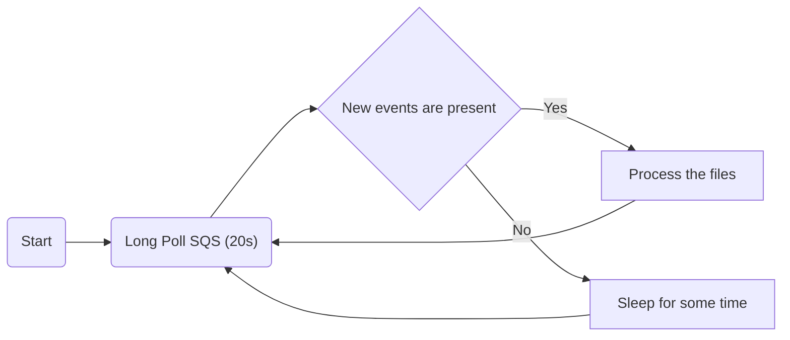

# ses_local_email

Receive emails via SES and store them in S3 bucket (setup via terraform).

On top of that, there are golang utilities:

- `s3_monitor`, monitors remote bucket for changes and downloads files if new ones were added (also removing them from the bucket).
  Adds `.eml` suffix to the files
- `eml_unpack_attachments`, monitors local directory for new files and unpacks attachments from them (assumes that new files are .eml)

## How does it work?

High level overview of the flow:


The "Monitor" part logic:



Processing the files is done in a loop, for each event:

- download email from S3, adding .eml suffix along the way
- remove email from S3
- remove message from SQS queue

As can be seen, downloading emails is an irreversible operation, as it removes email from the remote storage.
It's up to the user to ensure that data is stored in a safe place locally.

SQS polling is used instead of listing S3 bucket directly as it just seems cleaner and lighter in terms of S3 requests.

## How to use it?

This repository consists of two parts:

### AWS setup

Terraform module is provided in `terraform` directory.
It can be used to create necessary components on AWS's end.
It's required to set up [SES email receiving](https://docs.aws.amazon.com/ses/latest/dg/receiving-email-setting-up.html) first and
configuring this part is outside the scope of this project.

The minimum to get started is:

1. create `terraform.tfvars` file (in `terraform directory`) containing list of recipients that this program should "listen to":

```
recipients = ["some-email@your-domain.com", "yet-another-email@your-domain.com"]
```

2. run `terraform init`
3. run `terraform apply`
4. plug in the values obtained via `terraform output` as env variables in the following section

Terraform module also creates user with required policy permissions assigned and outputs credentials for it (you can use `terraform output -raw user_secret_key` to access the user's secret key).

### Bare metal

#### Download from S3

Small Go program is provided that can be used to download S3 objects as soon as they appear.

To run with Golang directly:

```
go install github.com/dezeroku/ses_local_email/s3_monitor@v0.2.0
ses_local_email
```

It's also available as a container:

```
docker run ghcr.io/dezeroku/ses_local_email_s3_monitor:latest
```

In both cases you'll have to set few environment variables for the program to work correctly:

- QUEUE_NAME
- BUCKET_NAME
- STORAGE_PATH (absolute path to a directory where the downloaded emails should be stored)

Under the hood [aws-sdk-go-v2](https://github.com/aws/aws-sdk-go-v2) SDK is used, refer to upstream documentation to see how to setup authentication.
Few useful variables that can be used here are:

- AWS_REGION
- AWS_ACCESS_KEY_ID
- AWS_SECRET_ACCESS_KEY

#### Unpack .eml attachments

Paperless doesn't seem to like [consuming .eml attachments from local storage](https://github.com/paperless-ngx/paperless-ngx/discussions/2823#discussion-4925418).
So we need to manually unpack the attachments from `.eml` file before having them consumed by paperless.

Small Go helper is written for just that

To run with Golang directly:

```
go install github.com/dezeroku/ses_local_email_eml_unpack_attachments@v0.2.0
ses_local_email
```

It's also available as a container:

```
docker run ghcr.io/dezeroku/ses_local_email_eml_unpack_attachments:latest
```

In both cases you'll have to set few environment variables for the program to work correctly:

- INPUT_DIRECTORY (local directory to monitor for `.eml` files)
- OUTPUT_DIRECTORY (where to put the unpacked attachments)

## But why?

I have recently started using [Paperless-ngx](https://docs.paperless-ngx.com/) that supports documents consumption via e-mail.
In short terms, you send a mail to a specific email address and paperless automatically fetches it and processes the documents attached to it.

Unfortunately my current email provider [mailbox.org](mailbox.org) does not support fine-grained access with separate set of credentials (honestly, why would they even do that?), so I can not create a separate directory and only allow paperless to access this single folder via IMAP.
Reasonable solution here is to use yet another email account that would only receive emails sent to `documents@your-domain.com` and give paperless access to that account instead.
But this requires paying for yet another account and at 3$/month it is hard to justify the expense, especially considering that I do not receive that many documents.

So I have decided to have some fun with it and implement a solution within AWS Free Tier bounds (with a penny or two of S3 costs on top of that).
It is also much more interesting to play with than simply creating a separate email account.

One important caveat is that this tool is intended to run as a sidecar in K8S that fetches emails and puts them in pod's filesystem, so Paperless mechanism can consume it, it does not work with Paperless' IMAP mechanism.
But that should be more than enough to do the job.
